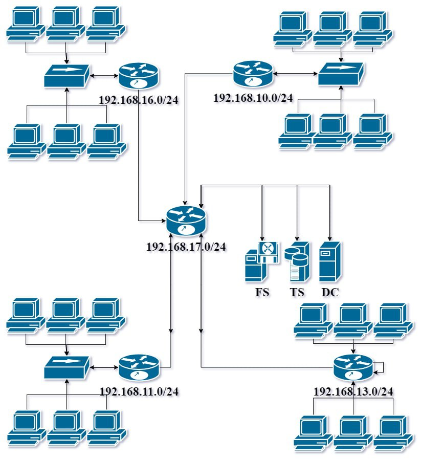

#Домашнее задание к занятию "3.8. Компьютерные сети, лекция 3"

1. Подключитесь к публичному маршрутизатору в интернет. Найдите маршрут к вашему публичному IP

        telnet route-views.routeviews.org
        Username: rviews
        show ip route x.x.x.x/32
        show bgp x.x.x.x/32
        
        route-views>show ip route 31.44.247.130
        Routing entry for 31.44.247.0/24
          Known via "bgp 6447", distance 20, metric 0
          Tag 2497, type external
          Last update from 202.232.0.2 2w6d ago
          Routing Descriptor Blocks:
          * 202.232.0.2, from 202.232.0.2, 2w6d ago
              Route metric is 0, traffic share count is 1
              AS Hops 3
              Route tag 2497
              MPLS label: none
              
              route-views>show bgp 31.44.247.130
        BGP routing table entry for 31.44.247.0/24, version 2350927850
        Paths: (22 available, best #21, table default)
          Not advertised to any peer
          Refresh Epoch 1
          7660 4635 8359 44267 50187
            203.181.248.168 from 203.181.248.168 (203.181.248.168)
              Origin IGP, localpref 100, valid, external
              Community: 0:3216 0:4635 0:9002 0:12389 0:16625 0:20485 0:20940 0:31133 0:32934 4635:4635 4635:65022 7660:6 7660:9003 8359:5500 8359:55638 44267:110 44267:210 44267:310 44267:410 44267:610
              path 7FE113A8A8C8 RPKI State not found
              rx pathid: 0, tx pathid: 0
          Refresh Epoch 1
          8283 1299 20485 50187
            94.142.247.3 from 94.142.247.3 (94.142.247.3)
              Origin IGP, metric 0, localpref 100, valid, external
              Community: 1299:30000 8283:1 8283:101
              unknown transitive attribute: flag 0xE0 type 0x20 length 0x18
                value 0000 205B 0000 0000 0000 0001 0000 205B
                      0000 0005 0000 0001
              path 7FE0A0FE0790 RPKI State not found
              rx pathid: 0, tx pathid: 0
 
2. Создайте dummy0 интерфейс в Ubuntu. Добавьте несколько статических маршрутов. Проверьте таблицу маршрутизации.

        vagrant@vagrant:~$ ip a
        1: lo: <LOOPBACK,UP,LOWER_UP> mtu 65536 qdisc noqueue state UNKNOWN group default qlen 1000
            link/loopback 00:00:00:00:00:00 brd 00:00:00:00:00:00
            inet 127.0.0.1/8 scope host lo
               valid_lft forever preferred_lft forever
            inet6 ::1/128 scope host
               valid_lft forever preferred_lft forever
        2: eth0: <BROADCAST,MULTICAST,UP,LOWER_UP> mtu 1500 qdisc fq_codel state UP group default qlen 1000
            link/ether 08:00:27:a2:6b:fd brd ff:ff:ff:ff:ff:ff
            inet 10.0.2.15/24 brd 10.0.2.255 scope global dynamic eth0
               valid_lft 82070sec preferred_lft 82070sec
            inet6 fe80::a00:27ff:fea2:6bfd/64 scope link
               valid_lft forever preferred_lft forever
        4: bond0: <NO-CARRIER,BROADCAST,MULTICAST,MASTER,UP> mtu 1500 qdisc noqueue state DOWN group default qlen 1000
            link/ether ba:ea:49:47:54:35 brd ff:ff:ff:ff:ff:ff
            inet 10.0.2.15/24 brd 10.0.2.255 scope global bond0
               valid_lft forever preferred_lft forever
        5: dummy0: <BROADCAST,NOARP,UP,LOWER_UP> mtu 1500 qdisc noqueue state UNKNOWN group default qlen 1000
            link/ether 76:3f:b9:44:98:f4 brd ff:ff:ff:ff:ff:ff
            inet 10.0.2.100/24 brd 10.0.2.255 scope global dummy0
               valid_lft forever preferred_lft forever
            inet6 fe80::743f:b9ff:fe44:98f4/64 scope link
               valid_lft forever preferred_lft forever

3. Проверьте открытые TCP порты в Ubuntu, какие протоколы и приложения используют эти порты? Приведите несколько примеров.

        *netstat -lt
        
        vagrant@vagrant:~$ sudo netstat -tl
        Active Internet connections (only servers)
        Proto Recv-Q Send-Q Local Address           Foreign Address         State
        tcp        0      0 localhost:domain        0.0.0.0:*               LISTEN
        tcp        0      0 0.0.0.0:ssh             0.0.0.0:*               LISTEN
        tcp6       0      0 [::]:ssh                [::]:*                  LISTEN
        
        *ss -lt
        
        vagrant@vagrant:~$ sudo ss -lt
        State         Recv-Q        Send-Q               Local Address:Port                  Peer Address:Port        Process
        LISTEN        0             4096                 127.0.0.53%lo:domain                     0.0.0.0:*
        LISTEN        0             128                        0.0.0.0:ssh                        0.0.0.0:*
        LISTEN        0             128                           [::]:ssh                           [::]:*

4. Проверьте используемые UDP сокеты в Ubuntu, какие протоколы и приложения используют эти порты?

        vagrant@vagrant:~$ sudo ss -lu
        State         Recv-Q        Send-Q                Local Address:Port                 Peer Address:Port        Process
        UNCONN        0             0                     127.0.0.53%lo:domain                    0.0.0.0:*
        UNCONN        0             0                    10.0.2.15%eth0:bootpc                    0.0.0.0:*
        
        vagrant@vagrant:~$ sudo netstat -ul
        Active Internet connections (only servers)
        Proto Recv-Q Send-Q Local Address           Foreign Address         State
        udp        0      0 localhost:domain        0.0.0.0:*
        udp        0      0 vagrant:bootpc          0.0.0.0:*

5. Используя diagrams.net, создайте L3 диаграмму вашей домашней сети или любой другой сети, с которой вы работали.

