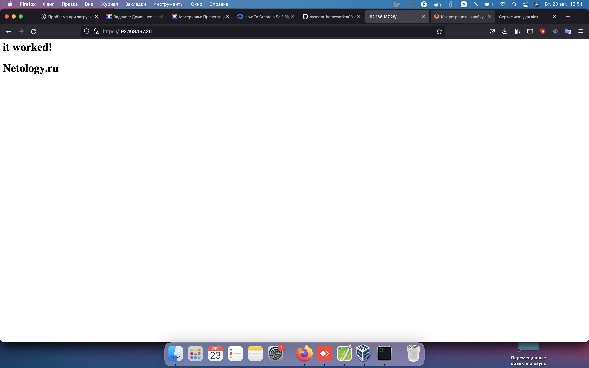
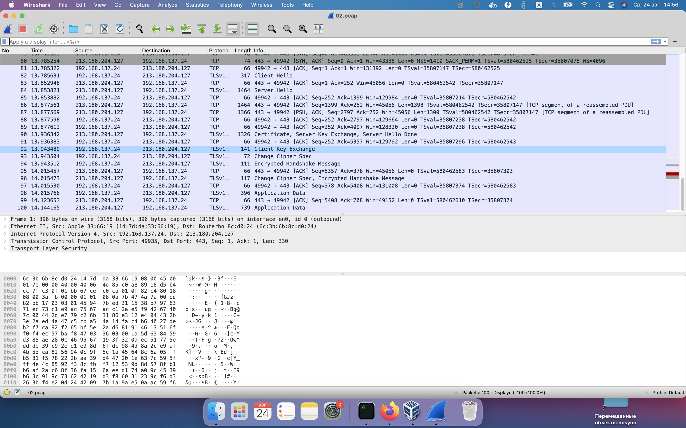

#Домашнее задание к занятию "3.9. Элементы безопасности информационных систем"

1. Установите Bitwarden плагин для браузера. Зарегестрируйтесь и сохраните несколько паролей.

 

2. Установите Google authenticator на мобильный телефон. Настройте вход в Bitwarden акаунт через Google authenticator OTP.

		Готово

3. Установите apache2, сгенерируйте самоподписанный сертификат, настройте тестовый сайт для работы по HTTPS.

  
 

4. Проверьте на TLS уязвимости произвольный сайт в интернете (кроме сайтов МВД, ФСБ, МинОбр, НацБанк, РосКосмос, РосАтом, РосНАНО и любых госкомпаний, объектов КИИ, ВПК ... и тому подобное).

		Start 2022-08-18 12:21:26        -->> 89.111.182.95:443 (plast-irkutsk.ru) <<--
		
		rDNS (89.111.182.95):   --
		Service detected:       HTTP
		
		Testing vulnerabilities
		
		Heartbleed (CVE-2014-0160)                not vulnerable (OK), timed out
		CCS (CVE-2014-0224)                       not vulnerable (OK)
		Ticketbleed (CVE-2016-9244), experiment.  not vulnerable (OK)
		ROBOT                                     not vulnerable (OK)
		Secure Renegotiation (RFC 5746)           supported (OK)
		Secure Client-Initiated Renegotiation     not vulnerable (OK)
		CRIME, TLS (CVE-2012-4929)                not vulnerable (OK)
		BREACH (CVE-2013-3587)                    potentially NOT ok, "gzip" HTTP compression detected. - only supplied "/" tested
		Can be ignored for static pages or if no secrets in the page
		POODLE, SSL (CVE-2014-3566)               not vulnerable (OK)
		TLS_FALLBACK_SCSV (RFC 7507)              Downgrade attack prevention supported (OK)
		SWEET32 (CVE-2016-2183, CVE-2016-6329)    VULNERABLE, uses 64 bit block ciphers
		FREAK (CVE-2015-0204)                     not vulnerable (OK)
		DROWN (CVE-2016-0800, CVE-2016-0703)      not vulnerable on this host and port (OK)
		make sure you don't use this certificate elsewhere with SSLv2 enabled services, see
		https://search.censys.io/search?resource=hosts&virtual_hosts=INCLUDE&q=DAC031AD7E0BB4302CCCD7AF89EEDF80D59B2CBE8A425C77F56689D4049E24A5
		LOGJAM (CVE-2015-4000), experimental      common prime with 4096 bits detected: RFC3526/Oakley Group 16 (4096 bits),
		but no DH EXPORT ciphers
		BEAST (CVE-2011-3389)                     TLS1: ECDHE-RSA-AES128-SHA ECDHE-RSA-AES256-SHA DHE-RSA-AES128-SHA DHE-RSA-AES256-SHA ECDHE-RSA-DES-CBC3-SHA EDH-RSA-DES-CBC3-SHA AES128-SHA AES256-SHA DES-CBC3-SHA
		VULNERABLE -- but also supports higher protocols  TLSv1.1 TLSv1.2 (likely mitigated)
		LUCKY13 (CVE-2013-0169), experimental     potentially VULNERABLE, uses cipher block chaining (CBC) ciphers with TLS. Check patches
		Winshock (CVE-2014-6321), experimental    not vulnerable (OK) - CAMELLIA or ECDHE_RSA GCM ciphers found
		RC4 (CVE-2013-2566, CVE-2015-2808)        no RC4 ciphers detected (OK)
		
		Done 2022-08-18 12:22:31 [0068s] -->> 89.111.182.95:443 (plast-irkutsk.ru) <<--

5. Установите на Ubuntu ssh сервер, сгенерируйте новый приватный ключ. Скопируйте свой публичный ключ на другой сервер. Подключитесь к серверу по SSH-ключу.

		vagrant@vagrant:~$ ssh-copy-id vagrant@192.168.137.23
		/usr/bin/ssh-copy-id: INFO: Source of key(s) to be installed: "/home/vagrant/.ssh/id_rsa.pub"
		The authenticity of host '192.168.137.23 (192.168.137.23)' can't be established.
		ECDSA key fingerprint is SHA256:8Lb/tKqeyNQllMhaDRbn8d8aX/ef6T2IkQ5EWnKa01s.
		Are you sure you want to continue connecting (yes/no/[fingerprint])? y
		Please type 'yes', 'no' or the fingerprint: yes
		/usr/bin/ssh-copy-id: INFO: attempting to log in with the new key(s), to filter out any that are already installed
		/usr/bin/ssh-copy-id: INFO: 1 key(s) remain to be installed -- if you are prompted now it is to install the new keys
		vagrant@192.168.137.23's password:
		
		Number of key(s) added: 1
		
		Now try logging into the machine, with:   "ssh 'vagrant@192.168.137.23'"
		and check to make sure that only the key(s) you wanted were added.
		
		vagrant@vagrant:~$ ssh vagrant@192.168.137.23
		Welcome to Ubuntu 20.04.4 LTS (GNU/Linux 5.4.0-110-generic x86_64)
		
		* Documentation:  https://help.ubuntu.com
		* Management:     https://landscape.canonical.com
		* Support:        https://ubuntu.com/advantage
		
		System information as of Wed 24 Aug 2022 04:14:26 AM UTC
		
		System load:  0.11               Processes:             129
		Usage of /:   12.0% of 30.63GB   Users logged in:       1
		Memory usage: 21%                IPv4 address for eth0: 10.0.2.15
		Swap usage:   0%                 IPv4 address for eth1: 192.168.137.23
		
		This system is built by the Bento project by Chef Software
		More information can be found at https://github.com/chef/bento
		Last login: Wed Aug 24 04:13:21 2022 from 10.0.2.2
		

6. Переименуйте файлы ключей из задания 5. Настройте файл конфигурации SSH клиента, так чтобы вход на удаленный сервер осуществлялся по имени сервера.

	vagrant@vagrant:~$ ssh test
	no such identity: /home/vagrant/.ssh/some_server.key: No such file or directory
	Welcome to Ubuntu 20.04.4 LTS (GNU/Linux 5.4.0-110-generic x86_64)
	
	* Documentation:  https://help.ubuntu.com
	* Management:     https://landscape.canonical.com
	* Support:        https://ubuntu.com/advantage
	
	System information as of Wed 24 Aug 2022 04:58:29 AM UTC
	
	System load:  0.0                Processes:             127
	Usage of /:   12.0% of 30.63GB   Users logged in:       1
	Memory usage: 21%                IPv4 address for eth0: 10.0.2.15
	Swap usage:   0%                 IPv4 address for eth1: 192.168.137.26
	
	
	This system is built by the Bento project by Chef Software
	More information can be found at https://github.com/chef/bento
	Last login: Wed Aug 24 04:56:33 2022 from 192.168.137.23

7. Соберите дамп трафика утилитой tcpdump в формате pcap, 100 пакетов. Откройте файл pcap в Wireshark.

